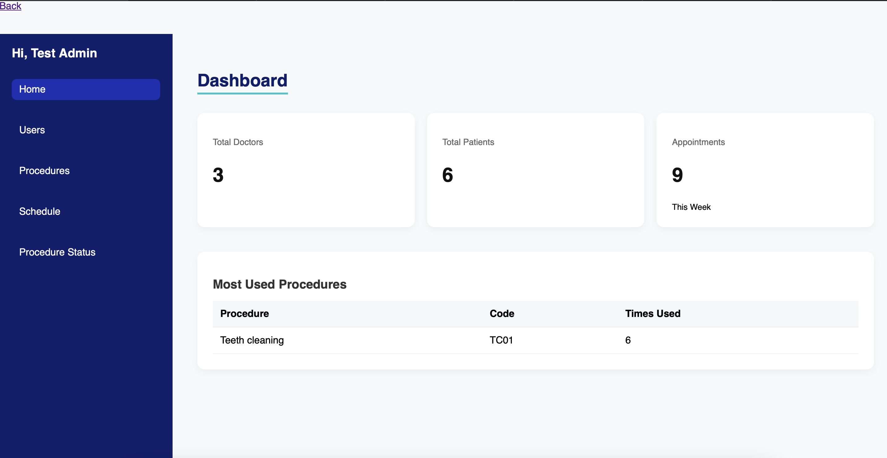
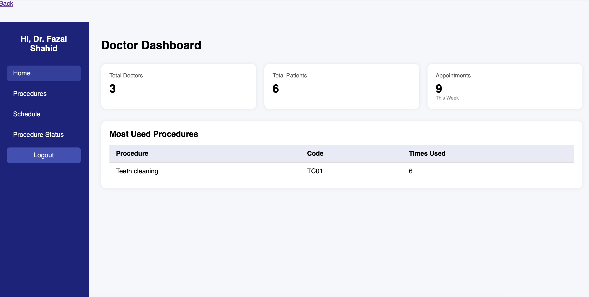
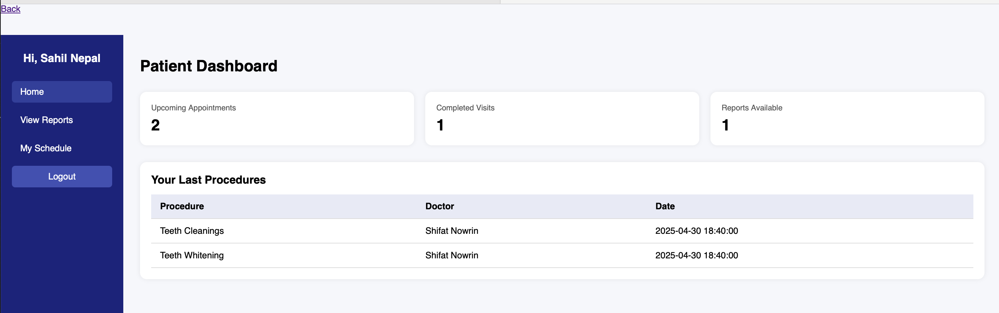

### 2025_IA637_project
#### Developed by:
- Bishruti Khakurel
- Shifat A Nowrin

# 🏥 Dental Clinic Management System

## Overview

This project is a web-based application that designed to streamline operations and enhance patient experience for a dental clinic. This application accomodate three primary users group; Doctors, administrators and patients. This system supports role-based access for administrators, doctors, and patients, enabling efficient management of appointments, medical procedures, and patient records. The goal of this project is to provide a modern, user-friendly interface where:

- Admins can manage users, assign doctors to patients, and schedule procedures,
- Doctors can view schedules, update procedure statuses, and maintain patient notes,
- Patients can log in after getting the credentials from the admin to view their appointments and reports securely.

## 📌 Features

### ✅ Authentication & Authorization
- Role-based login system (Admin, Doctor, Patient)
- Session-based access control
- Secure password handling (encrypted)

### 🧑‍⚕️ User Management
- Admin can add/edit/delete users
- Roles include:
  - **Admin**: Full access
  - **Doctor**: Manage procedures, update statuses
  - **Patient**: View personal schedules & reports

### 📅 Scheduling
- Admins can create schedules by assigning doctors to patients
- View schedules in calendar layout
- Conflict detection to avoid double-booking
- Status transitions:
  - Open → Booked → Completed

### 🦷 Procedures
- Admins and doctors can define procedures
- Link procedures to scheduled appointments
- Procedure status management with doctor notes

### 📊 Dashboard
- Separate dashboards for Admin, Doctor, and Patient
- Statistics displayed for admin and doctors (e.g., top procedures, upcoming appointments)

### 📄 Reporting
- Procedures status will be converted as report for user to see their full report
- Onlu patients can view reports in their dashboard under my reports 

## 🧑‍⚕️ User Roles and Functionalities

### **Admin Dashboard:**
- CRUD Operations on Users (Admin/Doctor/Patient)
- Manage Procedure Types (add/edit/delete)
- Create and assign schedules to doctors and patients
- View system statistics: total users, weekly appointments, top procedures

  

<em>Figure 1: Admin Dashboard</em>

### **Doctor Dashboard:**
- CRUD operations on Procedure(Delete the procedure will change the status of active procedure to inactive)
- View list of assigned appointments
- Update procedure status (Open → Booked → Completed)
- Add notes for each procedure
- View assigned patients

  

<em>Figure 2: Doctor Dashboard</em>

### **Patient Dashboard:**
- View personal appointments
- See doctor name and procedure type for each visit
- View uploaded medical reports

  

<em>Figure 3: Patient Dashboard</em>

## 🗃️ Database Design

### **Tables**

- **user:'Users'**
  - `UserID`, `Full_Name`, `Email`, `Password`, `UserRole`, `Phone_No`

- **procedures:'Procedures'**
  - `P_id`, `PList`, `PCode`, `PName`, `Pcost`, `PNotes`, `Status`

- **schedule:'Schedules'**
  - `SID`, `Start`, `End`, `HourBlocks`, `Status`, `PatientID`, `Notes`, `DoctorID`

- **procedure_Status: 'Procedure_Status'**
  - `SID`, `P_id`, `AdditionalProcedure`, `Notes`

### **Relationships**
- One Admin can manage many users
- One Doctor can have multiple assigned procedures
- One Patient can have multiple appointments
- One Schedule ties together a patient, doctor, and procedure

  

<em>Figure 4: Relational schema for this application</em>

## 🧱 Technology Stack

| Layer         | Technology      |
|---------------|-----------------|
| Backend       | Python (Flask)  |
| Frontend      | HTML/CSS, Jinja2 |
| Database      | MySQL           |
| Config Mgmt   | YAML            |

---

## 🖼️ Templates

### `base.html`
- Contains layout structure for all pages (sidebar, flash messaging, header).
- Displays navigation links based on session user role.

### `login.html`
- Allows user login.
- Validates role (Admin, Doctor, Patient) and redirects accordingly.

### `admin_main.html`
- Shows quick stats.
- Links to manage users, procedures, and schedules.

### `doctor_main.html`
- Lists upcoming appointments.
- Access to `procedure_status/manage.html` to update status.

### `patient_main.html`
- Displays schedule with doctor & procedure info.
- Read-only.

### `schedules/list.html`
- Displays schedule in calendar-style format.
- Filtered based on user role.

### `schedules/manage.html`
- Admin-only form for assigning doctors and procedures.

### `procedure_status/manage.html`
- Panel for doctors to:
  - View assigned procedures
  - Add notes and update status

## ⚙️ Configuration

### `config.yaml`
- db:
    - host: localhost
    - user: your_user
    - password: your_password
    - db: hospital_db
    - port: 3306

## Installation and Setup Instructions
basic Python and MySQL environment setup/Visual Studio code

#### Configure database connection:
- Create a MySQL database and user with appropriate permissions.
- Edit the configuration file (config.yaml) to specify database connection details like hostname, username, password, and database name.

## **🏃Running the Application**
**1.Clone the repository:**
<pre><code>git clone https://github.com/Clarkson-Applied-Data-Science/ia637_khakurb_nowrins.git

cd ia637_khakurb_nowrins  </code></pre>

**2.Start the development server:**
    python app.py
This will typically run the application on http://localhost:5000/ (default port for Flask development server).

## 🔐 Example User Credentials

Below are example credentials for testing the Hospital Management System with each user role.

| **Role**  | **Username** | **Password**   |
|-----------|--------------|----------------|
| Admin     | admin@admin.com       | admin1       |
| Doctor    | nowrin@s.com      | shifat        |
| Patient   | hema@gmail.com   | hema   |

## **Future Work**
- Enhance the user interface for a more intuitive and visually appealing experience.
- Explore integrating with social media platforms to allow users to share their treatment experiences.
- Consider adding features like video instruction related to treatment and personalized recommendations.
- Deploy the application to a cloud platform (e.g., Heroku, AWS) for scalability and accessibility.
- Implement error handling and user feedback mechanisms to improve user experience.
- Secure the application further by considering additional security measures like input validation, session.
- Report uploads (PDF or images)
- SMS/email appointment reminders
- Doctor rating system
- Calendar drag-to-reschedule
- Audit logs and user access trails

## 🛡️ Security Considerations

- Password hashing (use bcrypt or werkzeug.security)
- Session-based authentication
- Input validation (form level and DB)
- Role-based route access
